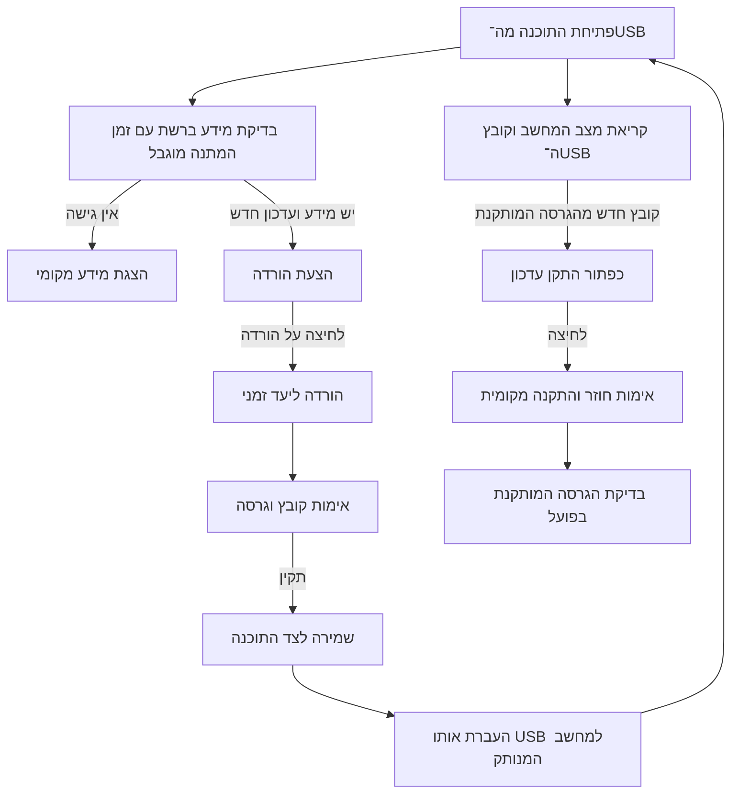

# ארכיטקטורה — תיקייה ניידת

תיקון מקומי 0.1.3: סיום WinUI מפורש לצורך עדכון, המתנה להורה לפני קריאת App והמתנה מוגבלת לנעילות לפני החלפה. תוצר 0.1.3 ב־artifacts/MivtzarNaki-0.1.3-lockfix פורסם; 0.1.4 פורסמה כיעד הבדיקה שלו. תוצאות ומגבלות מפורטות בראש STATUS ו־PLANS. אין שינוי בעותק המשתמש או Defender.

מקור מספר גרסת האפליקציה בקוד הוא Directory.Build.props בלבד. AppIdentity קורא metadata של assembly עבור הממשק ובדיקת העדכון; האריזה נגזרת מה־EXE. איחוד זה נבדק תחילה מקומית (53/53 tests), ונכלל בהפצות 0.1.3 ו־0.1.4 שנבדקו עם 55/55 tests. Release 0.1.2 הקיימת נשמרה; בדיקת המשתמש 0.1.1 -> 0.1.2 נכשלה בנעילת קובץ, כמפורט ב־STATUS.

הבחירות המאושרות הן ב־[החלטות המוצר](product-decisions.md). גבולות המערכת המוצעים מומשו בשלושה פרויקטים: Core, Windows ו־App. תוצאות האימות ומגבלותיו ב־[STATUS](STATUS.md).

## הכרעות המימוש שנבדקו

- WinUI 3 ו־.NET 10 באריזת תיקייה self-contained בשתי השכבות. כל קובצי runtime נשמרים ב־App; אין single-file, trimming, Native AOT או ReadyToRun. המשתמש אישר הרצת baseline 0.1.0 במחשב נקי ללא runtime נוסף וללא מנהל; 0.1.1 דורשת אימות נפרד.
- Core מכיל מדיניות, HTTP ואחסון. Windows מכיל אימות Authenticode, שירות/Registry, הפעלת מתקין ותיאום UpdateSession. App מכיל תצוגה, פקודות ואישורי משתמש.
- גרסת השרת נקראת מדף Defender הרשמי; ProductVersion של mpam-fe אומת מול חבילה רשמית. כשל זיהוי נשאר לא ידוע.
- ארבעה מקטעים לחבילות בגודל 8 MB ומעלה, רק עם Range ומזהה יציב. בדיקות מוכיחות המשך אחרי תשובה קטועה וחלופה לשרת שאינו תומך.
- קבצים נשמרים בתיקיות SHA-256, עם מצביע current.json המוחלף בסוף האימות. נשמרים נוכחי וקודם. קובץ חתימות אינו חלק מ־EXE התוכנה.
- בדיקה אוטומטית כל 15 דקות כשהתוכנה פתוחה ופנויה. בדיקות Defender ועדכון עצמי פועלות במקביל, כל אחת עם עד שלושה ניסיונות, ארבע שניות לניסיון ותקציב כולל של 15 שניות. Retry-After נשאר בתוך התקציב; כשל אמון או מידע פגום אינו גורר retry. פעולה מקומית אינה ממתינה לרשת; אין שירות רקע.
- מתקין מקומי מועתק לתיקייה זמנית, מאומת וננעל נגד כתיבה בזמן ההפעלה. הצלחה תלויה בקריאת גרסת Defender לאחר סיום התהליך.
- אימות חתימה משתמש במידע אמון מקומי/שמור ומתאים לעבודה מנותקת; אינו מבצע בדיקת ביטול מקוונת. שורשי אמון חסרים גורמים לכשל, לא לעקיפת אימות.
- עדכון עצמי מופרד מהחתימות. Distribution מגדיר כברירת מחדל version.json ב־main של talmidhon/MivtzarNakiPortable; הגדרה ישנה ריקה משתמשת בו בלי כתיבה להגדרות. URI מפורש נשמר. feed ו־download חייבים להשתייך לאותו מאגר בבעלות המפתח, ותג ההורדה תואם לגרסה. ZIP מכיל App/ בלבד ומניפסט עם SHA-256 לכל קובץ. דחיית נתיבים מסוכנים, קישורים, כפילויות, קבצים עודפים וחבילה חלקית קודמת להחלפה. הורדה כושלת מנקה candidate חלקי; כשל אינו מוחק App או נתוני משתמש.

ה־helper מועתק לתיקייה מקומית מחוץ ל־USB, מאמת שוב את החבילה, ממתין להורה ומחליף את App. הגרסה החדשה מאשרת טעינת XAML בתוך 20 שניות; כשל הפעלה גורר שחזור. גיבויים נשמרים ב־`.updates/previous-GUID`; Data ו־OfflinePayloads אינם משתתפים בהחלפה. עותק verified הזמני מנוקה בסיום האימות. עותקי helper וגיבויים נשמרים ומצריכים ניקוי ידני לאחר סגירת התוכנה ואימות ההצלחה. הפסקת חשמל בין שינויי שמות תיקיות אינה טרנזקציה אטומית ועלולה לדרוש שחזור ידני; ראו README.

בסיס האחסון נגזר מ־Environment.ProcessPath: כאשר EXE נמצא ב־App עם מניפסט, הבסיס הוא תיקיית האב. אין תלות בתיקיית העבודה. לוג diagnostic והגיבוי שלו מוגבלים לכ־512 KiB כל אחד בתוספת רשומה אחת; הודעה ופרטי שגיאה מקוצרים ל־2,000 תווים.

הממשק משתמש ב־Grid ו־RTL ב־XAML. ב־HWND מנוקה LAYOUTRTL כדי למנוע שיקוף כפול. מספרי גרסאות ונתיבים מוגדרים LTR. רוחב התוכן קשור לרוחב Viewport כדי שפתיחת פרטים בחלון קטן לא תרחיב אותו מעבר לחלון. ערכות Light/Dark/HighContrast משתמשות במשאבים; HighContrast נקרא ללא שינוי הגדרות מערכת. fixtures משביתים פעולות מערכת; `--smoke-test` יכול לבדוק טעינת XAML וערכה גם במסלול fixture.

אימות: success/rollback/session של helper אמיתי עברו גם ב־0.1.1, עם HTTP מדומה ושימור נתונים. בנוסף עבר E2E מול feed ו־ZIP הציבוריים: מנוע baseline 0.1.0 בעותק עם דרייבר, download/אימות/staging/StartReplacement/helper והפעלת App אמיתית 0.1.1 עם אישור XAML. כל קובצי App והגיבוי אומתו; settings/logs/payload נשמרו. עותק מקוצר של נכס שפורסם נדחה בלי שינוי App. אישור XAML בודק פתיחה בלבד; לחיצה פיזית על כפתור העדכון והפסקת חשמל לא אומתו. כשל acknowledgement ההיסטורי אינו מוסבר; כשלי קידוד metadata החדשים נרשמו ותוקנו בכלי הפרסום, בלי שינוי ZIP. פרטים ב־STATUS. קבלה חזותית חיצונית של 0.1.1, HighContrast וקורא מסך אינם PASS.

ההפצה משתמשת ב־public/main, תגי v, Releases ו־version.json כמו Acer. build workflow יוצר draft בלבד ולא דורס Release קיים. publish-version מאמת latest stable, assets, SHA-256 וגרסת מניפסט לפני פרסום feed; הוא מדלג על prerelease וחוסם downgrade. אין מתקין, symbols או self-signing. פרטים ב־[release/update](release-update.md). הסעיפים להלן משמרים את התכנון המקורי; תוצאות מאומתות ב־STATUS גוברות על שאלות היסטוריות.

## גבולות הרכיבים

| רכיב מתוכנן | אחריות | גבול |
|---|---|---|
| ממשק WinUI 3 | עברית RTL, שלוש גרסאות בפרטים סגורים, פעולות, התקדמות והסברים | מתאם פעולות מפורשות דרך UpdateSession; אין לוג בממשק |
| תהליכי עבודה וליבה | בדיקה, הכנת USB, התקנה, תוצאות ומדיניות גרסאות | אינו תלוי בפקדי WinUI או ב־Registry |
| שילוב Windows | מצב Defender, מידע קובץ, חתימה, הרשאות והרצת מתקין | מחזיר תוצאות מפורשות; אינו משנה מערכת בבדיקה בלבד |
| רשת ואחסון | מקורות Microsoft, מקטעים, המשך הורדה, אחסון נייד ולוגים | אינו מתקין חתימות ואינו מחליף קובץ תקין לפני אימות |
| עדכון התוכנה | בדיקת גרסת אפליקציה, הודעה, חבילה והחלפה לאחר לחיצה | נפרד מחתימות Defender, ומשמר אותן בזמן החלפה |

הגבולות מומשו בשלושת הפרויקטים לעיל. אין שרת, בסיס נתונים, שירות Windows קבוע או הפעלה אוטומטית לאחר סגירת התוכנה.

## זרימת המשתמש

חיבור לאינטרנט אינו מבטל את הצורך בתהליך הכנת USB, וניתוק אינו מונע קריאת מידע מקומי. אפשרות התקנה מפורשת היא פעולה נפרדת; הצלחת הורדה אינה מפעילה אותה.

## מצבי עבודה ותוצאות

הצעה: מוכן, בודק, עדכון זמין, מוריד, מושהה לאחר ניתוק, מאמת, מוכן להתקנה, מתקין, מאמת תוצאה, בוטל ושגיאה. בקשת תיקון היא פעולה נפרדת עם הסבר ואישור.

התוכנה תבדיל בין ״הקובץ מעודכן מול Microsoft״, ״המחשב מעודכן ביחס לקובץ״ ו״הגרסה האחרונה ברשת אינה ידועה״. אי־אפשר לקבוע שהמחשב מעודכן בעולם רק מפני שהקובץ ב־USB אינו חדש ממנו.

## החלטות שדורשות הוכחה

- אריזה ניידת ב־C# ו־WinUI 3: תיקייה הכוללת תלויות. המשתמש דיווח על קבלת baseline במחשב נקי ללא runtime נוסף; קבלה חוזרת של בינריים חדשים אינה מוכחת בכך. בדיקת imports אינה הוכחת תאימות לכל Windows.
- גרסאות: לשמור בנפרד גרסת אפליקציה וגרסת חתימות. יש לאמת איזה שדה בקובץ Microsoft מתאים לגרסה המותקנת, ולא להסתמך אוטומטית על FileVersion או על כותרות HEAD.
- הורדות: לבדוק HTTP Range בפועל; להמשיך רק כאשר מזהה הקובץ לא השתנה. כשאין תנאים להמשך או למקביליות, לעבור להורדה מלאה בטוחה עם הודעה מתאימה.
- אחסון: להשאיר קובץ תקין קודם עד סוף אימות החדש. לתכנן התאוששות מניתוק USB, כונן מלא, קריאה בלבד ושני מופעים פעילים.
- אימות: חתימה תקינה, זהות מפרסם Microsoft ושלמות; באופליין אין להפוך חוסר גישה לבדיקת תעודות לרישיון לדלג על אימות.
- התקנה: הרשאות רגילות ככל האפשר, העלאה נקודתית לפי צורך, ותוצאה לפי גרסת היעד בפועל. כישלון אינו מפעיל תיקון ללא הסכמה.
- עדכון עצמי: Acer מספק דוגמה למטא־דאטה ולהודעות, אך המתקין שלו מיועד לתוכנה מותקנת. כאן מוחלפת תיקיית App ונשמרים חתימות, לוגים והגדרות. המקור החדש הוא MivtzarNakiPortable; תוצאות המקור החי ב־STATUS.

מקור האריזה ההיסטורי: [Microsoft — הפצת WinUI 3 ללא MSIX](https://learn.microsoft.com/en-us/windows/apps/package-and-deploy/unpackage-winui-app). המסירה הנוכחית היא unpackaged self-contained בתיקייה. נבחרו רכיבי WinUI 2.3.0, Foundation 2.3.5, InteractiveExperiences 2.1.3 ו־DWrite 2.1.0 בהתאם לגרסאות שב־metapackage 2.3.1; רכיבי AI/ML/Widgets שאינם בשימוש הושמטו. היעד המוצהר בפרויקט הוא Windows 10 build 19041 ומעלה, x64; Windows 10 לא נבדק בפועל.
